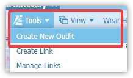
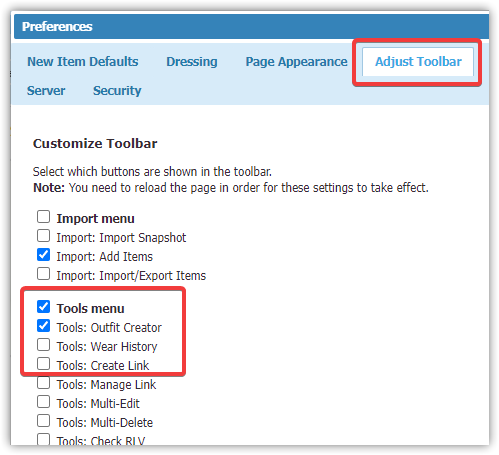
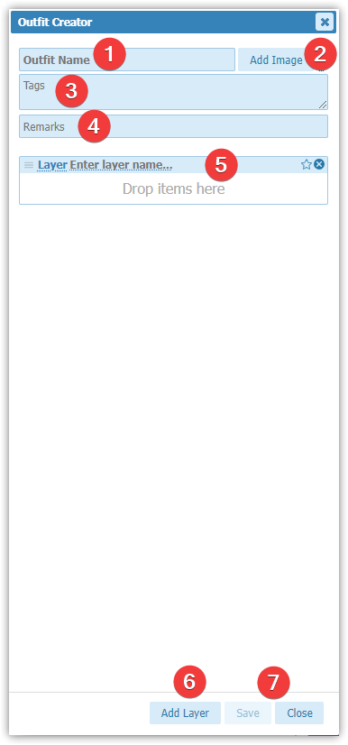
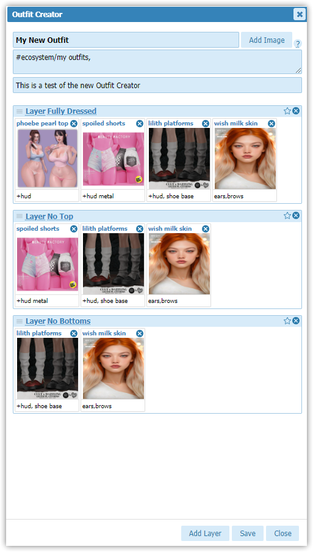

The Outfit Creator was released on May 9 2024 as a new premium offering in [CTS Wardrobe](cts-wardrobe.md). "An outfit is a collection of Wardrobe items that lets you define the entire appearance of your avatar, organized in multiple layers." This new feature also comes with a new [stripme](stripme.md) option that will allow others in [[Second Life]] to remove (or re-add) clothing based on the layers defined in the outfit which was created.

### enabling outfit creator

This is a premium feature and requires additional payment above the core of Wardrobe. You can access the Outfit Creator panel by clicking on **Tools** then **Create New Outfit**.

If you would like the Outfit Creator button to always be visible in Wardrobe. Click **Preferences** then **Adjust Toolbar** and select **Tools: Outfit Creator**. Refresh your Wardrobe page to see the new button.

### navigating the outfit creator dialog

1. **Outfit Name** - Type the name for the outfit you are creating. This name will show in the Wardrobe entry for your outfit.
2. **Add Image Button** - Click the **Add Image** button to add a custom image for your outfit. Once clicked you can select an image as normal from a local file, url or full perm UUID in Second Life. If you do not select and image Outfit Creator will use an image from one of the items in the outfit.
3. **Tags** - Add tags to sort and organize your saved outfits. 
4. **Remarks** - Type any notes or comments about your saved outfit.
5. **Layers Section** - The main part of the Outfit Creator. This will be covered in the [[#building a new outfit]] below.
6. **Add Layer Button** - See [[#building a new outfit]] section below.
7. **Save & Close Buttons** - Once you are finished with your outfit, or any updates, click on **Save** to commit your changes. Click Close to **close** the dialog without saving.

### building a new outfit

The Outfit Creator allows you to build an outfit using different layers. These layers are worn when you put on an outfit. The order of the layers can be used by you or others through the CTS Wardrobe web interface to dress or undress the avatar layer by layer. It can also be used with the new stripme tool to allow anyone to do the same simply by clicking your avatar.

The way the system is currently built you add all of the items you want with the outfit to the default layer (usually the top most layer) and then in each subsequent lower layer you remove the items that you want to be removed.

In the example below I have 4 pieces of an outfit. A top, shorts, shoes and a skin. I have these divided into three layers. 

**Layer 1** is fully dressed. This should be made up of all of the items from Wardrobe that you want to wear as part of the outfit. 

**Layer 2** is No Top. In this layer I add all of the items from layer one minus the top I want to have removed.

**Layer 3** is Not Bottoms. In this layer I add all of the items from layer 2 minus the shorts I want to have removed.

The names you use for each layer are customizable. You can choose anything that makes sense to you and matches the outfits use case.

